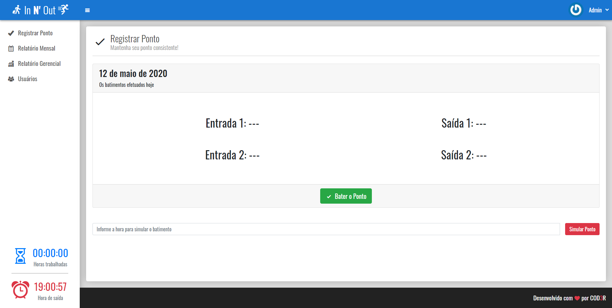
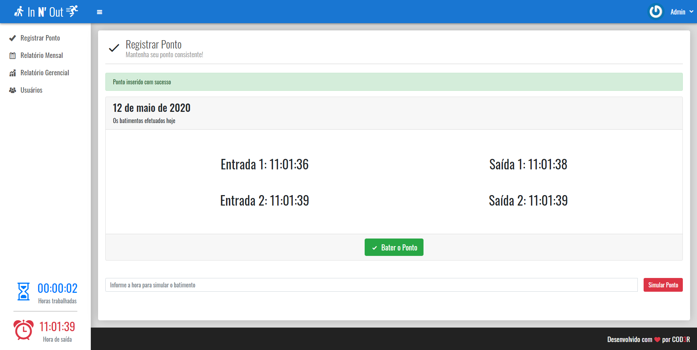
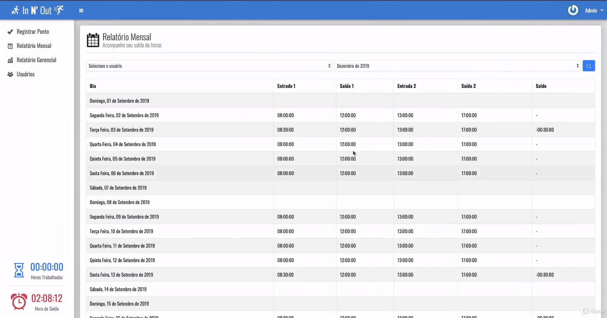
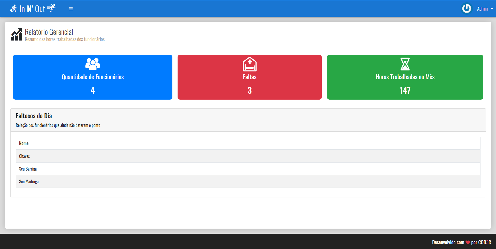
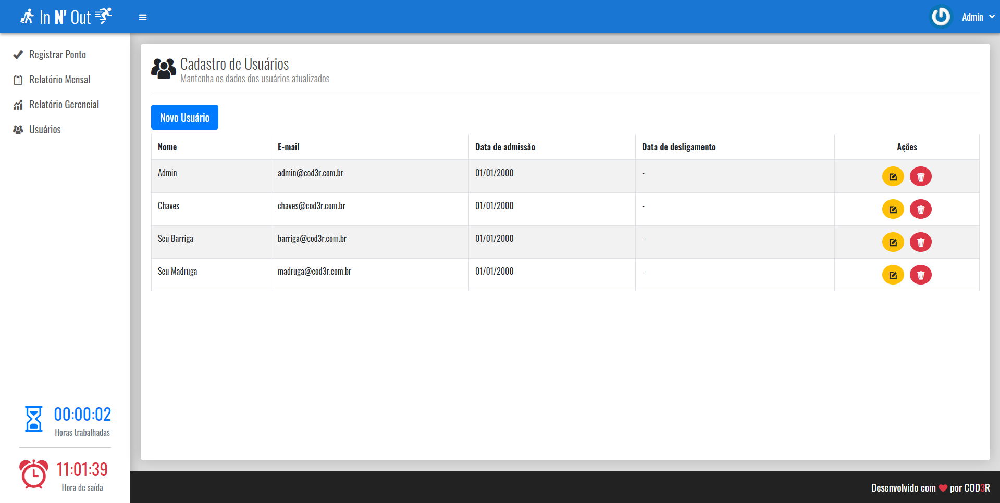
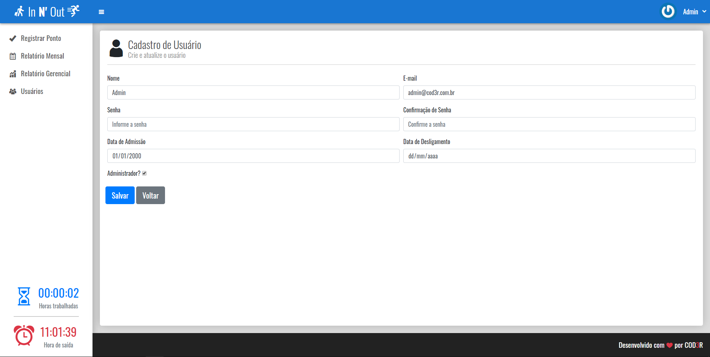

# In N' Out
 
_(Tela principal)_
&nbsp;

#### Esta aplicação foi desenvolvida no Projeto Final do curso de PHP 7 da COD3R. É um sistema para controle de ponto, com horário de entrada, saída, cálculo de horas, relatórios mensais, entre outros. 
&nbsp;

 
_(Pontos batidos)_
&nbsp;

* Nessa página, é possível registrar ponto e observar o cálculo de horas trabalhadas e também o horário de saída;
* Caso o usuário não tenho preenchido a última saída, o contador irá recomendar o horário de saída ideal para completar as 8 horas;
* Também é possível simular o batimento de ponto, para testar as diversas funcionalidades do sistema.
&nbsp;

 
_(Relatório mensal)_
&nbsp;

* Aqui é possível acompanhar os horários dos funcionários em um determinado mês, selecionado no filtro;
* Se o usuário for um admin, ele pode também filtrar por um outro usuário. Para colaboradores, este filtro fica indisponível.
&nbsp;

 
_(Relatório gerencial - sem menu lateral)_
&nbsp;

* Nesta aba é possível consultar a quantidade de funcionários, quantos faltaram no dia e a quantia de horas trabalhadas no mês;
* Tanto essa, como a página seguinte, são visíveis apenas para administradores.
&nbsp;

 
_(Usuário)_
&nbsp;

* Aqui é possível criar, editar, consultar e deletar usuários do sistema.
&nbsp;

 
_(Edição de usuário)_
&nbsp;

